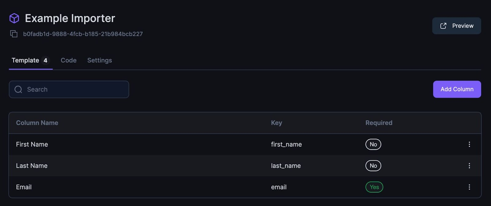

To get started with TableFlow, you'll first  configure an `importer`. This defines the columns, validations, and settings for how users import data. There are three options for configuration.

### Option 1: Admin UI
This no-code option is the quickest way to configure a new `importer`. Navigate to [app.tableflow.com/importers](https://app.tableflow.com/importers) and create a new importer.
<Frame>
    
</Frame>

### Option 2: SDK
This option allows developers to configure the `importer` directly inside their front-end code. Step 2, [Embed Importer](/embed-importer), will describe how to leverage this option.

### Option 3: API
Using the API, developers can create and update the `importer` object programmatically from their backend. The [Create Importer](/api/create-importer) endpoint provides details.
