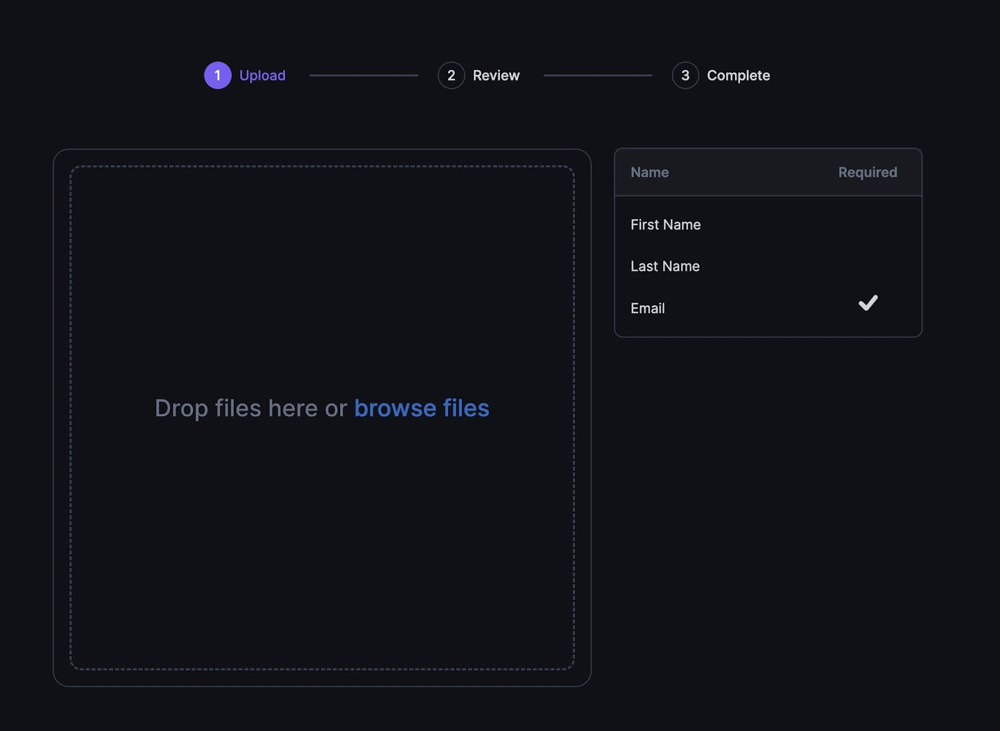
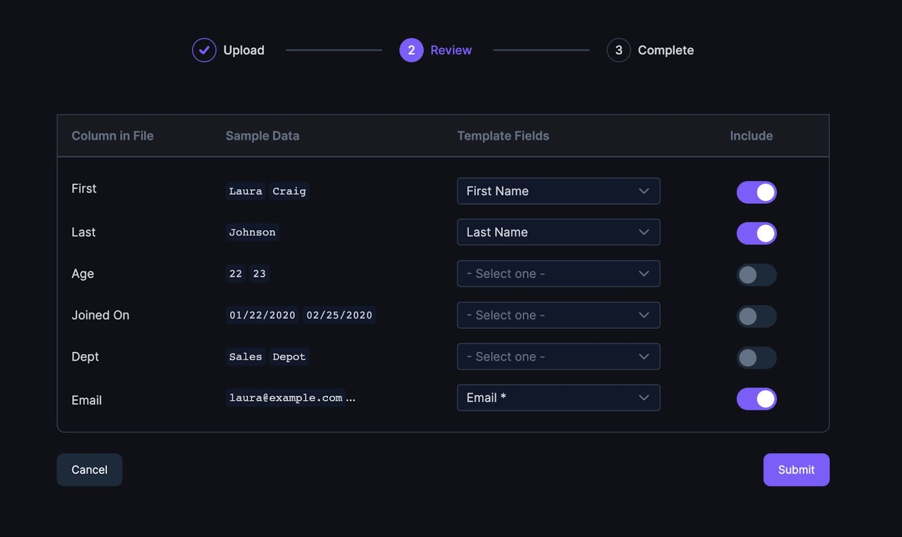
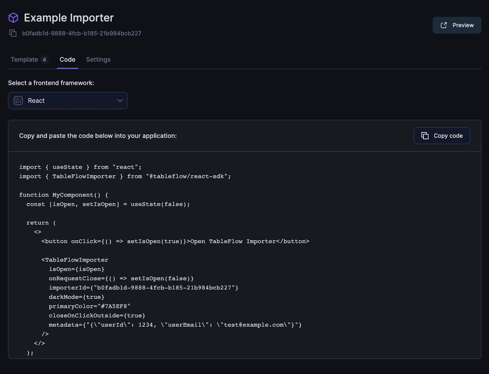
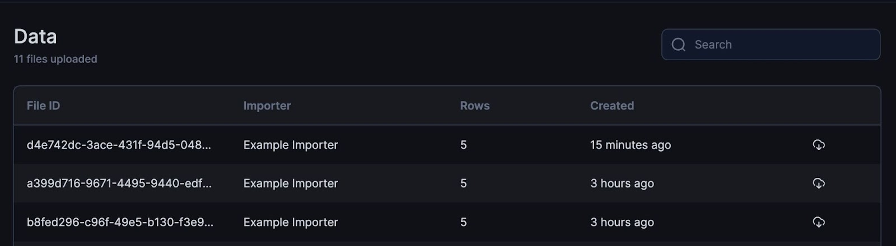

To see how TableFlow works, let’s walk through the setup for an Importer that is used to upload contacts into your application.

### 1. Create Importer

You’ll first create an importer in the TableFlow app. This is where you’ll define the columns, types, validations, and other settings for how you want your users to import data.
<Frame>

</Frame>
Here we’ve created an importer with three columns for First Name, Last Name, and Email. When your users are importing data with this importer, these are the columns they will be expected to provide in their files.

### 2. Use Importer

The next step is to deploy your new importer. This can be done by sharing the link to the importer directly or by embedding it into your front-end application:

#### Option 1: Previewing and sharing your Importer
To test the importer (and to share the link with a user), you can press the “Preview” button to open it in a new tab.
<Frame>

</Frame>
With the importer open you’ll see the three columns we previously defined. After selecting a file (either .csv or .xlsx) to upload, TableFlow will analyze the columns in the file, collect sample data, and perform validations.

After this is done you’ll be brought to the “Review” stage where you can map the columns in your uploaded file to the columns that the importer is expecting. If TableFlow detects already similarly named columns in your importer and file, it will pre-select the mapping (i.e. a column in the file called “first” will map to “first name”).
<Frame>

</Frame>
After selecting the mapping, pressing “Submit” will trigger the import process where the data from the file will be mapped and transformed to the format expected by the importer. See the next section on where the data goes and how you can consume it.

#### Option 2: Embedding your Importer into your front-end application

TableFlow is designed to be added to your front-end so you don’t have to write a custom file importer every time you need to collect data in a different format. The libraries for React and JavaScript allow you to open the importer as a modal.
<Frame>

</Frame>
You can find code samples with your importer information already added in the “Code” tab of the Importer in the TableFlow app:

If you want to add additional metadata to your import, such as wanting to know which user ID in your application uploaded a file, you can set the “metadata” property with any data as JSON. You can then see this metadata when retrieving the data later via the API.

### 3. Retrieve Data

#### Option 1: In the TableFlow app

The easiest way to see the data which has been importer is right within the TableFlow app under the “Data” tab. Here you can download the files directly as CSV.

While this is useful for testing, you’ll want to use the next option if you have a system to consume the imported data.

#### Option 2: Retrieve data via the API

The TableFlow API can be used to retrieve imported data so it can be used by your system. With the API you can paginate through the imported data as JSON, download the file directly as CSV, and retrieve metadata about the import.
<Frame>

</Frame>
Coming (very) soon: receive a webhook when an import has been completed so your system can consume the data in near real-time.
