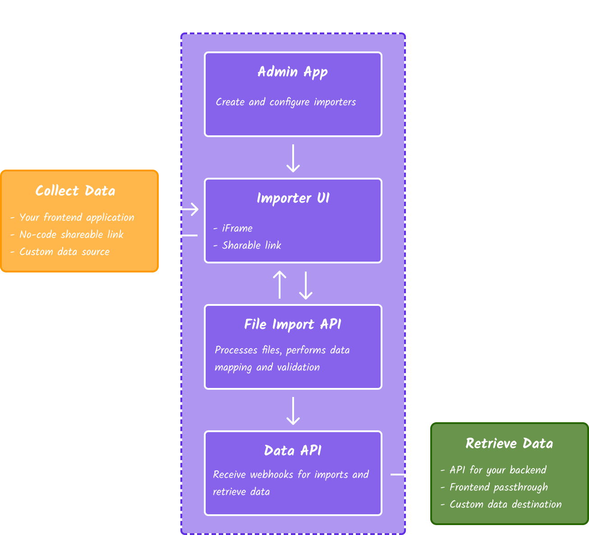

TableFlow is an open source data import platform for businesses to onboard their customers. Instead of building CSV and Excel import support from scratch, you can embed or link to the TableFlow importer and begin collecting data from customers immediately.

You can get started with [TableFlow Cloud](https://app.tableflow.com) or [self host](https://github.com/tableflowhq/tableflow) in your own infrastructure.

<CardGroup cols={2}>
  <Card title="Quick Start" icon="person-running-fast" href="quick-start">
    Start collecting data from your customers in minutes.
  </Card>
  <Card title="How It Works" icon="person-chalkboard" href="how-it-works">
    Learn the basics about the platform and features.
  </Card>
</CardGroup>

## Platform Architecture
<Frame>
    
</Frame>

## Get In Touch
We'd love to hear any feedback or feature requests! You can submit a GitHub issue or contact us at [hey@tableflow.com](mailto:hey@tableflow.com).
